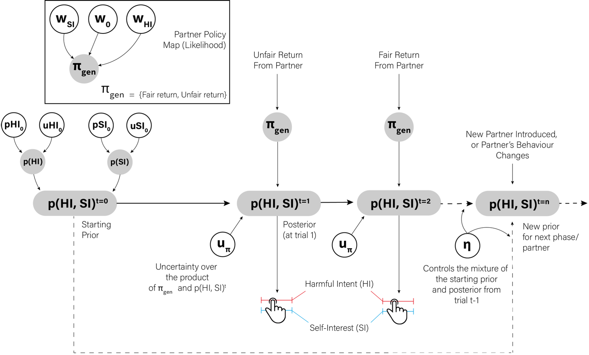

# Bayes-Belief Social Attribution Model
Model tutorial and code for the Bayesian Belief social inference model reported in Barnby et al., (2020) &amp; Barnby et al., (2022)

Papers using this model: 

1. https://journals.plos.org/ploscompbiol/article?id=10.1371/journal.pcbi.1008372
2. https://psyarxiv.com/x4d3f/

Just load in the tutorial and toolkit into your favourite IDE and click through the examples :) 

NB: Current tookit uses Differential Evolution Optimisation to fit and recover model using a MAP wrapper.

Currently in development: 

  - Hierarchical fitting
  - Development of these scripts as an R and Python package



## Brief overview of functions


#### Simulate some data

Sweep through a series of values of one parameters to assess it's contribution to attributional dynamics

```{r}
simulatedata_HISI(x = 'pHI0', values = 10, samples = 100, trials = 10, partners = 2, plot = 1, upi = 0.9)
```

Alternatively, set parameters to be specific values

```{r}
simulatedata_HISI(x = 'pHI0', values = 10, samples = 100, trials = 50, partners = 2, plot = 1,
                  uHI0 = 2, pSI0 = 0.3, uSI0 = 2, upi  = 0.9, w0   = -1, wHI  = 0.5, wSI  = 0.5, eta  = 1)
```

### Recover the model

Simulate random parameter values per participant and refit the model to ensure the code is working properly

```{r}
cores = 4
RecoverModel_HISI(
  variations = 150,          # how many samples of parameters need to be drawn from a normal distribution?
  trials = 10,               # how many trials will the synthetic participants play with each partner?
  partners = 2,              # how many partners/styles of partner will they see?
  partner_type = 'fair',     # if partner = 1, what type of partner will they see?
  corrplot = 1,              # do you want to see a correlation of the parameters at the end?,
  n_cores = cores
)
```

### Fitting some data

This fitting function allows Maximum-A-Priori (MAP) approximation for all parameters within the model, using a differential evolution optimiser.

The data input needs to be a list, with each entry being a participants
returns for each trial, and their harmful intent and self interest
attributions, and trial number, in that order:

| Return | Harmful Intent | Self Interest | Trial |
|:------:|:--------------:|:-------------:|:-----:|
| 0.5    | 50             | 50            | 1     |
| 0      | 60             | 65            | 2     |
| 0      | 60             | 70            | 3     |
| ...    | ...            | ...           | n     |

I am working on a hierarchical implementation to fit the model, although this is a WIP. 
Please get in touch if you'd like to help with this!

### Fit model to data using MAP appoximation

```{r}

load('ExampleData.Rdata')

Fitted_Values <- FitModel_HISI(ExampleData, plot = 1, cores = 4, tn = 10, phase = 2)

Fitted_Values[[1]] # This is the data with estimated parameters
Fitted_Values[[2]] # This is the simulated data using the parameters from Fitted_Values[[1]]
Fitted_Values[[3]] # These are the plots to check the parameter approximation and overall model fit

```
