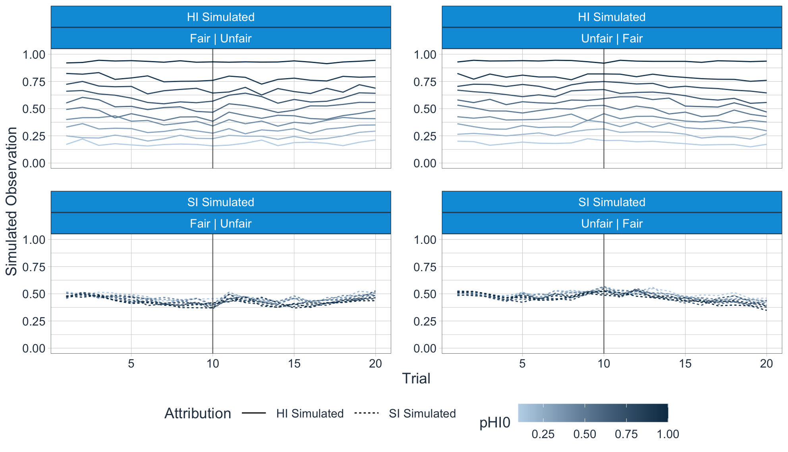
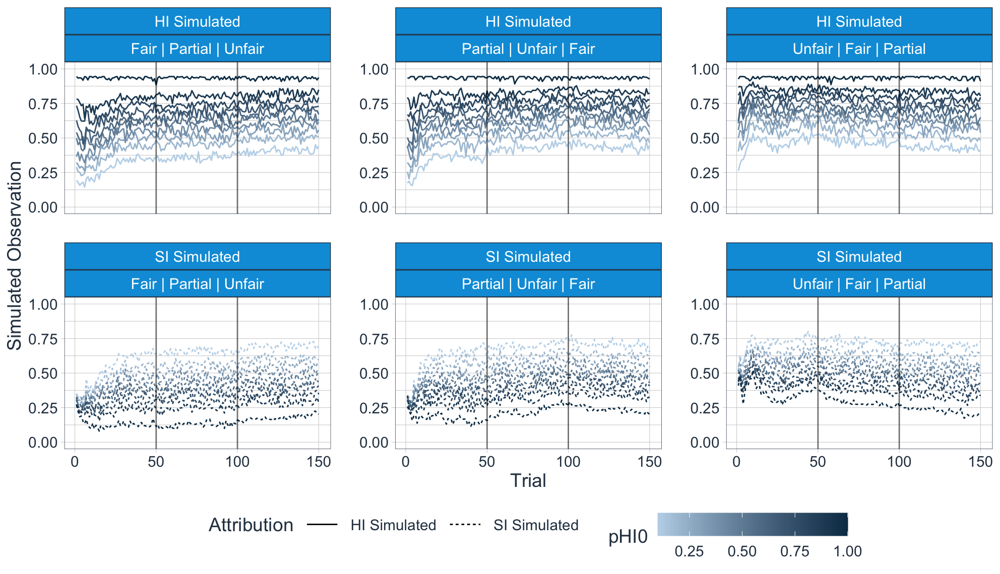
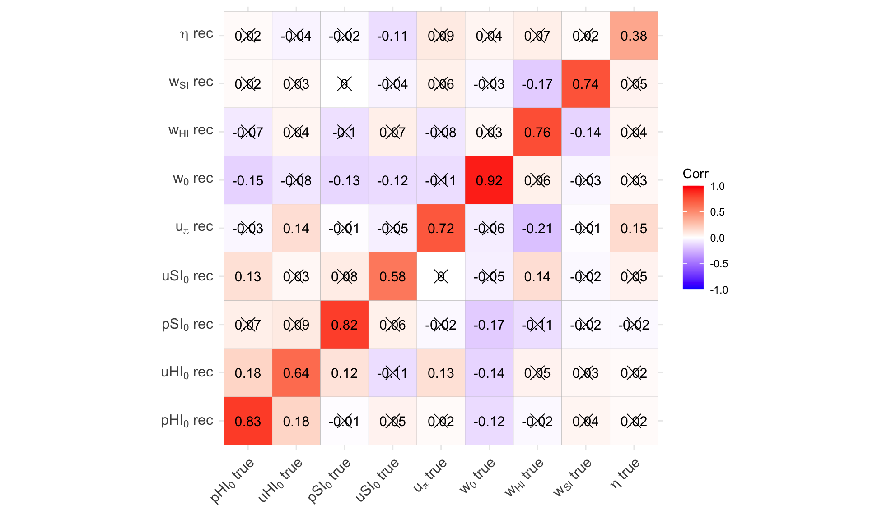
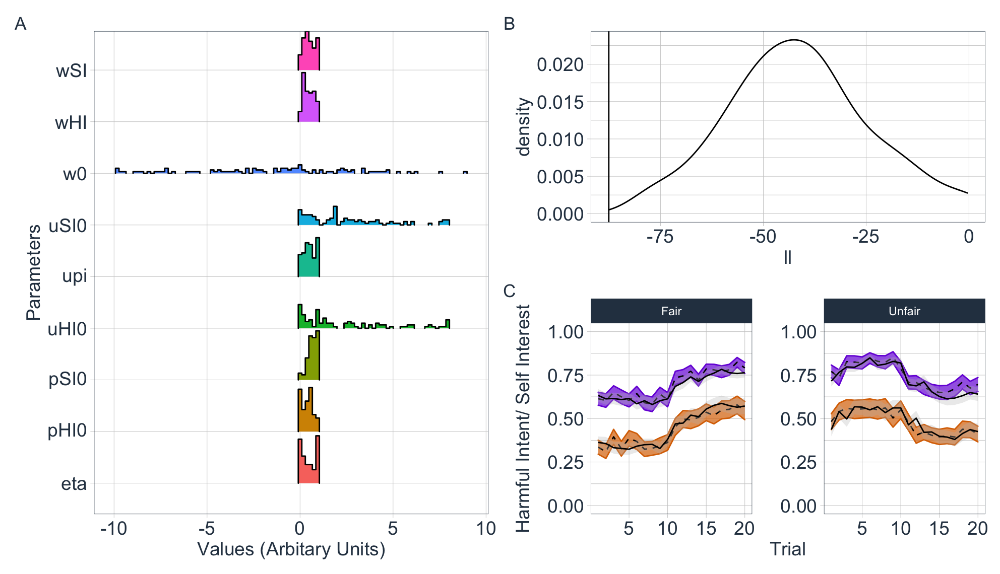

# Bayes-Belief Mental State Attribution Model
Model tutorial and code for the Bayesian Attributional Inference model reported in Barnby et al., (2020) &amp; Barnby et al., (2022). Software developed by Joe Barnby (Royal Holloway, University of London) & Michael Moutoussis (University College London).

Natively the model runs off any game theoretic set up where the partner (the agent) makes one of two actions (e.g. fair or unfair split of money) and the participant (the subject) attributes some form of intentional stance to their partner. In our work we have opted for harmful intent attributions (the belief that the partner is actively trying to reduce the participants money) and self interest attributions (the belief that the partner is just interested in maximising their own reward irrespective of the participant).

This model allows shallow Depth of Mentalisation (sDoM) estimation of the participant's beliefs (Barnby et al., 2023; Trends in Cognitive Sciences) - that is, their belief given the observed history of their partner without any extra forward planning. 

Papers using this model: 

1. https://journals.plos.org/ploscompbiol/article?id=10.1371/journal.pcbi.1008372
2. https://journals.plos.org/ploscompbiol/article?id=10.1371/journal.pcbi.1010326

Just load in the tutorial and toolkit into your favourite IDE and click through the examples :) 

NB: Current tookit uses Differential Evolution Optimisation to fit and recover model using a MAP wrapper.

Currently in development: 

  - Hierarchical fitting
  - Development of these scripts as an R and Python package

### Anatomy of the model


White nodes represent free parameters of the model. Grey shaded nodesrepresent numerical probability matrices built from free parameters. Thick solid and thick dotted lines represent transitions between trials. Thin solid lines represent the causal influence of a nodeon another node or variable. The agent or participant updates their initial beliefs (starting prior) about the partner’s intentions [p(HI, SI)_t=0] each trial using their policy matrix of the partner [pi] which maps the likelihood between a partner’s return to the participant and the partner’s true intentions. We assume that upon detecting a change (e.g. a reversal or a new participant), participants re-set their beliefs, using their priors about people in general (thin dotted line), biased by what they have learnt already about their present partner [eta]. Both the policy matrix and initial beliefs about the partner are numerical matrices that assigned probabilities to each grid point of values of harmful intent (0-1) and self-interest (0-1). The model can be used to simulate observed attributions of intent given a series of returns, or inverted to infer the parameter values for participants, using experimentally observed attributions.

## Brief overview of the functions in the tutorial script

#### Simulate some data

Sweep through a series of values of one parameters to assess it's contribution to attributional dynamics. This is a very useful function to generate some formal predictions for how the model might perform under certain conditions.

```{r}
simulatedata_HISI(x = 'pHI0', values = 10, samples = 100, trials = 10, partners = 2, plot = 1)
```

Here, we've simulated 10 different values of pHI0, each with 100 synthetic participants, over 20 trials with 2 partners.



Alternatively, set parameters to be specific values

```{r}
simulatedata_HISI(x = 'pHI0', values = 10, samples = 100, trials = 50, partners = 2, plot = 1,
                  uHI0 = 2, pSI0 = 0.3, uSI0 = 2, upi  = 0.9, w0   = -1, wHI  = 0.5, wSI  = 0.5, eta  = 1)
```
Here, we've simulated 10 different values of pHI0, each with 100 synthetic participants, over 50 trials with 2 partners. I have additionally set some parameters to change from their default values.



### Recover the model

Simulate random parameter values per participant and refit the model to ensure the code is working properly

```{r}
cores = 4
RecoverModel_HISI(
  variations = 150,          # how many samples of parameters need to be drawn from a normal distribution?
  trials = 10,               # how many trials will the synthetic participants play with each partner?
  partners = 2,              # how many partners/styles of partner will they see?
  partner_type = 'fair',     # if partner = 1, what type of partner will they see?
  corrplot = 1,              # do you want to see a correlation of the parameters at the end?,
  n_cores = cores
)
```

This correlation matrix demonstrates the correlation between the ground-truth parameters used to simulate data, and the recovered parameters approximated from MAP estimation.



### Fitting some data

This fitting function allows Maximum-A-Priori (MAP) approximation for all parameters within the model, using a differential evolution optimiser.

The data input needs to be a list, with each entry being a participants
returns for each trial, and their harmful intent and self interest
attributions, and trial number, in that order:

| Return | Harmful Intent | Self Interest | Trial |
|:------:|:--------------:|:-------------:|:-----:|
| 0.5    | 50             | 50            | 1     |
| 0      | 60             | 65            | 2     |
| 0      | 60             | 70            | 3     |
| ...    | ...            | ...           | n     |

I am working on a hierarchical implementation to fit the model, although this is a WIP. 
Please get in touch if you'd like to help with this!

### Fit model to data using MAP appoximation

```{r}

load('ExampleData.Rdata')

Fitted_Values <- FitModel_HISI(ExampleData, plot = 1, cores = 4, tn = 10, phase = 2)

Fitted_Values[[1]] # This is the data with estimated parameters
Fitted_Values[[2]] # This is the simulated data using the parameters from Fitted_Values[[1]]
Fitted_Values[[3]] # These are the plots to check the parameter approximation and overall model fit

```

The output of this function shows (in addition to the raw data):
- (A) Distribution of individually fitted parameters from the data
- (B) Distribution of the loglikelihood values for each participant (which demonstrates model fit). NB: If the model was simply 'guessing' without any explanatory power, we would expect the loglikelihood values to cluster around -87.88 (the vertical solid line on the plot). This line will change depending on the amount of trials - for example - for 100 trials the loglikelihood of a randomly performing model would be -439.44.
- (C) The simulated (solid black line) and real data (dotted line with coloured ribbon) for harmful intent (orange) and self interest (purple). This is important to quantify the generative performance of the model on your data and assess whether it can accurately reproduce the real behavioural results, thereby demonstrating generative validity (Palminteri et al., 2017). In this plot, the data is also faceted by whether a participant saw a fair partner first, or an unfair partner first. 


